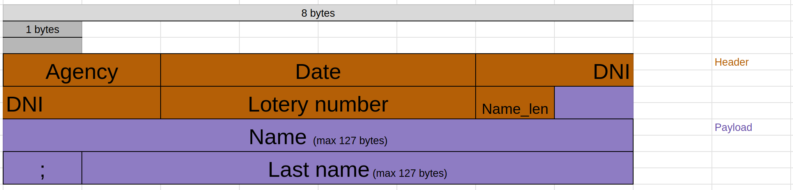

#### EJ 1:
Se definió un script de bash "scripts/docker-compose-client-generator" que escribe en un nuevo archivo las definiciones del docker compose. El docker-compose-dev.yaml final tendrá la definición del servidor al inicio y la red al final. En el medio se definirán n clientes, cada uno con el nombre cliente{i} y  con la variable de entorno CLI_ID=i. Luego, cuando aparecieron los volúmenes se agregaron estos a las definiciones en el .yaml. Entonces al servidor se le agrega la definición de un volumen de configuración, y al cliente uno de configuración. También se agregó un comando extra en el makefile docker-compose-up-clients que antes de hacer el comprise up llama al script con el valor que tengo la variable de entorno CLIENTS. Si esta no esta inicializada por default instancia 2

#### Ej2:
Para evitar tener que hacer un nuevo build de las imágenes de docker cuando hay algún cambio en el config, ya sea del cliente o del server se agregaron dos volúmenes de tipo bind, uno para el servidor, y uno para los clientes. Se hace el bind entre  una carpeta del docker y una carpeta de la máquina local, permitiendo que la modificación de los archivos dentro de la carpeta desde la máquina local se vea reflejada automáticamente en el container. De esta manera al hacer un cambio en el config, al estar en un volumen, no se hará una nueva imagen, simplemente se utilizará la última y al iniciar se verán los cambios reflejados en el config.

#### Ej3:
Para correr el test se debe correr el script test-EchoServer.sh . Este script buildeara tanto el container del servidor e iniciara la red, pero sin levantar un cliente. Luego se hace un build con el dockerfile de la carpeta script, esta imagen será la del container cliente que se comunique con el servidor. Una vez levantado el cliente se lo inicia y se lo manda a ejecutar el script teste-EchoServer-Client.sh, que instala netcat en el container y manda un mensaje al echoserver. finalmente se bajan todos los containers.

#### Ej4:
A continuación se explica cómo se implementó el gracefull finish tanto en el servidor como en el cliente.
##### Servidor:
En el servidor defini un handler para la señal SIG_TERM que cierra los sockets, tanto el que escucha nuevas conexiones, como el que se utiliza para comunicar con un cliente ya establecido. Cuando se levanta una SIG_TERM, se corta la ejecución normal del código y se ejecuta este handler, antes de seguir con la ejecución normal. Esto hace que el código que se venía ejecutando con sockets abiertos, ahora los tenga cerrados. Lanzando asi excepciones que son catcheadas por los try, que cortan el ciclo de ejecución infinito del servidor, haciendo que termine naturalmente el programa.
##### Cliente:
El código del cliente consta de un loop donde manda mensajes y espera la respuesta del echoserver. Para hacer el gracefull finish, lo que hice fue crear un channel por el cual voy a recibir la SIG_TERM. Esto me permite que al finalizar cada iteración pueda intentar recibir del channel para ver si se debe finalizar. Si ya paso LoopPeriod segundos, se continúa con el envío y recepción del próximo mensaje. Ahora, esto trae un problema, que es el de operaciones bloqueantes en el loop (como un recv) que hacen que si nuestro programa estaba bloqueado cuando se envía la SIG_TERM no nos enteremos, y nuestro programa será frenado con un SIG_KILL. Para evitar esto, el recv ahora se hace desde una go routine que manda por un chanel lo que recibe. De esta manera se pueden hacer todas las operaciones no bloqueantes al inicio del loop, y luego en un select, quedarse esperando por el primero de 4 eventos. Ya sea terminar el loop porque ocurrio un timeout de LoopLapse, terminar el loop si se recibe un SIG_TERM, o recibir el mensaje y seguir con la siguiente iteración después de LoopPeriod segundos. Este select garantiza que la señal será escuchada independientemente de que operación bloqueante se esté realizando.

#### Ej5:
##### Protocolo
Para resolver el ejercicio se plantea el siguiente protocolo de comunicacion. Luego de hacer una conexion tcp, el cliente, mandara una bet al servidor, y este le respondera con un ack. El mensaje bet que envia el cliente esta compuesto por un header que contiene los campos:  
- agency(2 bytes): Es un u16 en big endian order que representa el numero de la agencia
- date(4 bytes): El primer bytes indica el dia, el segundo el mes, y los ultimos dos se interpretan como un u16 en big endian order que representa 
- dni(4 bytes): Es un u32 en big endian order que representa el numero de dni
- lottery_number(4 bytes): Es un u32 en big endian order que representa el numero de loteria
- name_len(1 bytes): Es un u32 en big endian order que representa la cantidad de bytes que usan los nombres
Luego como paiload de mensaje se enviara el nombre y apellido. Se enviaran ambos dentro del mismo campo separados por un ';'. Los clientes entonces tendran como maximo 255 bytes, debido a que name_len tiene un bytes, de los cuales uno es usado para el separador. Entonces se define que el nombre y el apellido pueden tener como maximo 127 bytes cada uno, si un nombre o apellido tiene mas caracteres se tomo la desicion de truncarlo.

Este protocolo pone varias restricciones sobre la longitud o cantidad de cosas, por ejemplo la longitud de nombre o cantidad de agencias, pero estas asumo son lo suficientemente holgadas, y se podrian agrandar simplemente cambiando el tipo de dato.
Entonces luego de que el cliente parsee y envie los datos, el servidor recibira primero un header de tama;o fijo 15, y luego lo usara para obtener cuantos bytes leer de los nombres. Una vez recibida y almacenada la bet el servidor responder con un ack. En cuanto al protocolo respecta este es un mensaje de un byte, sin importar su contenido. El servidor en la practica enviara siempre el byte 255. El cliente verificara la llegada de ese byte para verificar el almacenamiento de la bet.
 
##### Short Read y short write
Para evitar el short read y el short write, implemente las funciones send_all y recv_exactly. Send all envia todo un array de bytes, y recv_exactly recive exactamente una cantidad de bytes. Esto se logra enviando o recibiendo en principio todos lo bytes, si se enviaron o recibieron menos, entonces se repite la operacion con los bytes restantes hasta haber enviado o recibido todos los bytes.

##### Aclaracion
Decidi mantener la logica anterior donde los clientes enviaban multiples veces el mismo mensaje cada LoopPeriod dentro del loop, siempre que no exedan el LoopLapse. 